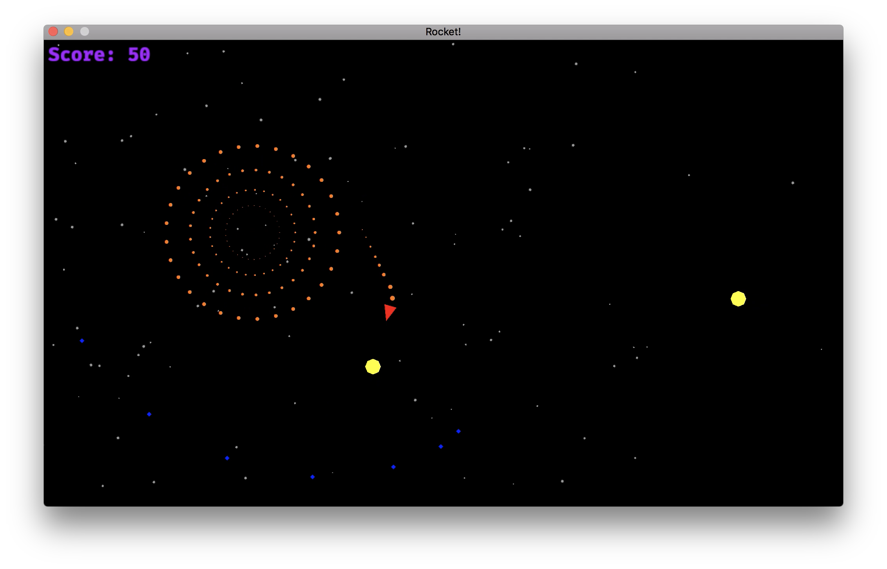

RustRider
======

> Rocket is a toy game written in Rust, using the [`ggez`](https://github.com/ggez/ggez) library. The code is thoroughly
commented in order to help people to follow it easily.

## Screenshots



You can find more screenshots in the [screenshots] directory.

[screenshots]: screenshots/

## How to play

As you can see in the screenshots below, you are the red rocket and have to save the world from
the yellow invaders. To do so, you can use the following controls:

Keyboard                | Action
----------------------- | ------------
<kbd>&uparrow;</kbd>    | Boost
<kbd>&leftarrow;</kbd>  | Rotate left
<kbd>&rightarrow;</kbd> | Rotate right
<kbd>Space</kbd>        | Shoot

### Running RustRider

Unless you are using Windows, you'll need to install SDL2 on your system. There are detailed instructions [here](https://github.com/Rust-SDL2/rust-sdl2). And as always, it is a real pleasure to work with Cargo. You only need the following:

```
cargo run --release
```